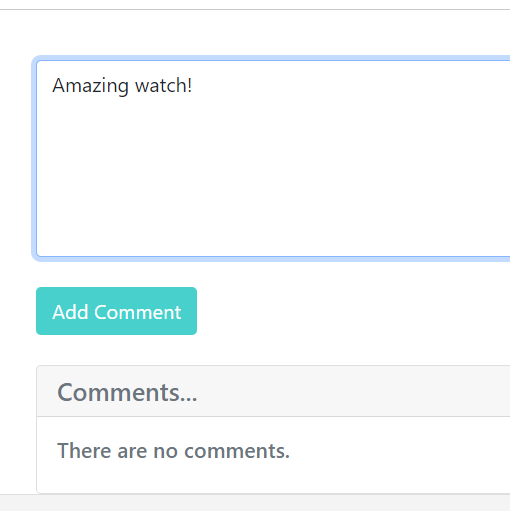

# Commerce

## Commerce project description:

This project started as a part of CS50's Web Programming with Python and JavaScript and their problem set task. 
It was written by using Python, Django, JavaScript, HTML, while Bootstrap and CSS were used for styling.
It is an eBay-like e-commerce auction site where users can post auction listings, place bids on listings, comment on those listings, and add listings to their “watchlist”.

## *Active Listings* page before logging in

*Active Listings* page is the front page and displays all the listings regardless of user being logged in or logged out.
Next to the *Active Listings*, on the navbar there are also some additional links *Categories* - dropdown that displays all the categories, *Register* - where users can register if they don't have a profile and *Log in* - where users can log in if they aren't already.

## *Active Listings* page after logging in

After the user has logged in, additional links appear in the navbar: *Watchlist*, *Create Listing*, *Closed Listings* and *Log Out*:

At the bottom of the *Active Listings* page, pagination was added for going through pages: 

Name of the product represents the link to that product's page and by clicking it we get additional information about each product.
There users can add products to their watchlist, place bids, comment products...

#### - Adding to Watchlist

If the user is not the one that created a particular listing, he can add it to its watchlist as well as place bids:

Once the user has added a product to its watchlist, he can also remove it by clicking on a *Remove* button, while the *Add to Watchlist* button is disabled.

If the user is the one that has created the listing, *Add to Watchlist* button is disabled, but the user has the ability to close that listing:

#### - Placing a Bid

If user tries to place a bid that is smaller than the current product's price, he gets a message that his bid is not big enough:

Entering a Smaller Bid     |  Message Display
:-------------------------:|:-------------------------:
  |  

If user places a bid that is bigger, that bid also becomes the product's current price:

#### - Commenting a Listing

Users can comment the listings. If the comment box is empty, *Add comment* button is disabled. When user writes something, button gets enabled and user can add a comment:

Empty comment              |  Text added
:-------------------------:|:-------------------------:
  |  

Once the comment has been added, users cat put a *like* or *dislike* to it, as well as to reply to it by clicking a *Reply* button.

By clicking on a *Reply* button, comment section pops up. Like before, *Reply* button is disabled if the comment box is empty and it gets enabled when user writes something:

Empty comment              |  Text added
:-------------------------:|:-------------------------:
  |  

After adding a comment and after replying to it, this is how they are displayed:

### Watchlist

*Watchlist* displays all the products that user has added to its watchlist with product's basic information. Name of the product again represents the link to that product's page. On this page, each product also gets additional *Remove* button for removing the product from the watchlist without having to enter that product's page to do that.

### Create Listing

Users can create their own listings. While creating a listing, they have to write product's name, choose a product category from the categories that are offered, write a starting bid, product's description as well as add images (2 images per listing).

### Categories

*Categories* link has a drop-down with all the categories that we have:

If user clicks on a category that doesn't have any item in it, our page will display that:

If the choosen category has products, they will all be displayed:

### Closed Listings

*Closed Listings* page displays the listings that are closed:

If a user clicks on a listing that was closed, he gets information about the user that placed the highest bid as well as the information who was that user:

### Search

At the end of the navbar there is a *Search* button.
If the user types in a at least a part of the listing's name, he will get all the listings contain that:

