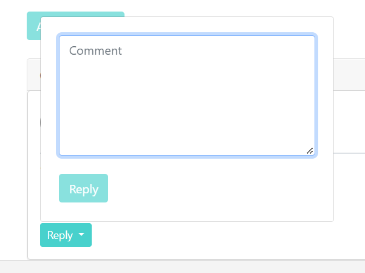

# Commerce

## Commerce project description:

This project started as a part of CS50's Web Programming with Python and JavaScript and their problem set task. 
It was written by using Python, Django, JavaScript, HTML, while Bootstrap and CSS were used for styling.
It is an eBay-like e-commerce auction site where users can post auction listings, place bids on listings, comment on those listings, and add listings to their “watchlist”.

## Active Listings page before logging in

Before users create their profiles and log in, they can see all the *Active Listings* as well as product *Categories*.
In addition to that, on the *navbar* they have links where they can *Register* their profile if they don't have it and a link to *Log In* if they are not logged.

## Active Listings page after logging in

After the user has logged in, additional links appear in the navbar: *Watchlist*, *Create Listing*, *Closed Listings* and *Log Out*:

### Create Listing

Users can create their own listings. While creating a listing, they have to write product's name, choose a product category from the categories that are offered, write a starting bid, product's description as well as add images (2 images per listing).

If the user is not the one that created a particular listing, user can add it to its watchlist as well as place bids:

Once the product has been added to the watchlist, user can see all the products on its watchlist, and it can also remove them from the watchlist:

User can also remove the product from the watchlist from the product's page as well:

If we try to place a bid that is smaller than the current product price, we get a message that our bid is not big enough:

if we place a bid that is bigger, that bid also becomes the product's current price:

If the user is the one that has created the listing, *Add to Watchlist* button is disabled, but the user has the ability to close that listing:

Users can comment the listings. If the comment box section is empty, *Add comment* button is disabled:

When user writes something, button gets enabled and user can add a comment:

Once the comment has been added, users cat put a *like* or *dislike* to it, as well as to reply to it by clicking a *Reply* button.

Empty comment              |  Text added
:-------------------------:|:-------------------------:
  |  

After adding comment and after replying to it, this is how they are displayed:

*Categories* link has a drop-down with all the categories that we have:

If user clicks on a category that doesn't have any item in it, our page will display that:

If the choosen category has products, they will all be displayed:

